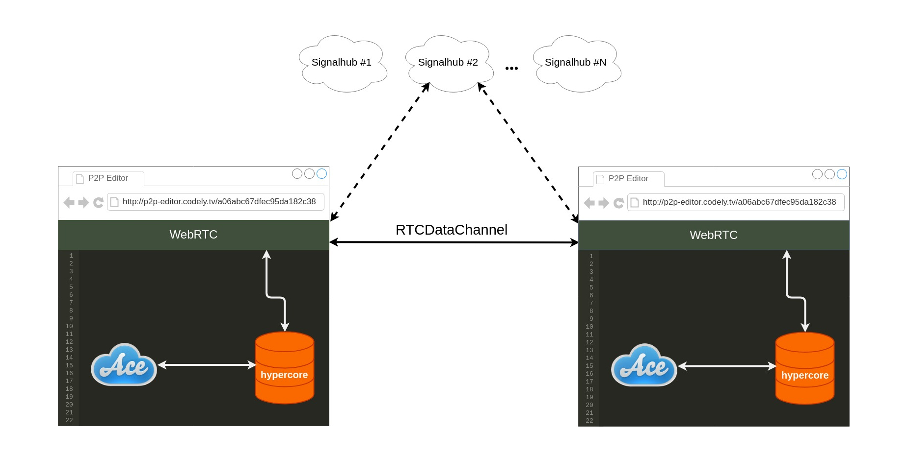

<!-- LOGO -->

  

<!-- TITLE -->
<h1 align="center">
  P2P Editor
</h1>

<!-- BADGES -->

    
    
    

<!-- SUMMARY -->

  P2P code editor for live coding sessions that works in the browser.
   
   
  This parallel P2P universe is still very dark. <a href="https://github.com/CodelyTV/p2p-editor/stargazers"> Create a Star</a> if you want to make it brighter  🌟
   
   
  <a href="#table-of-contents"><strong>🚀 Explore the universe »</strong></a>
   
   
  <a href="http://p2p-editor.codely.tv">Online demo</a>
  ·
  <a href="https://github.com/CodelyTV/p2p-editor/wiki">Roadmap</a>
  ·
  <a href="#-contributing">Contribute</a>

<!-- TABLE OF CONTENTS -->
## 📜 Table of Contents

- [💡 What does P2P Editor do?](#-what-does-p2p-editor-do)
- [🤔 Why P2P?](#-why-p2p)
  - [Benefits of P2P](#benefits-of-p2p)
  - [Added complexities of being fully distributed](#added-complexities-of-being-fully-distributed)
- [🏗️ Architecture](#-architecture)
- [🚀 Environment setup](#-environment-setup)
  - [🐳 Needed tools](#-needed-tools)
  - [🛠️ Environment configuration](#-environment-configuration)
  - [🌍 Application execution](#-application-execution)
  - [✅ Tests execution](#-tests-execution)
- [💻 Live demo](#-live-demo)
- [ℹ️ About](#-about)
- [🤝 Contributing](#-contributing)
- [⚖️ License](#-license)

## 💡 What does P2P Editor do?

P2P Editor is a code editor that works in the browser which lets you share live coding sessions. See it by yourself sharing a new session:

1. [Open a P2P Editor session in your browser](http://p2p-editor.codely.tv)
2. Share your session URL with someone else (or even with yourself in another browser window 😬)
3. Start typing and enjoy the real time experience!

The functionalities are limited for now, but we have a [roadmap](https://github.com/CodelyTV/p2p-editor/wiki) and some [good first issues](https://github.com/CodelyTV/p2p-editor/issues?q=is%3Aissue+is%3Aopen+sort%3Aupdated-desc+label%3A%22good+first+issue%22) to make P2P Editor awesome. Take a look to the [Contributing](#-contributing) section if you want to get involved 🙌. 

## 🤔 Why P2P?

We have removed the need of having a centralized server where all the changes get saved. The communication is done from one peer (a connected user) to the other one. By doing this we have some benefits, but we also have to take into account the added complexity:

### Benefits of P2P

- Direct communication: reduce latency and bandwidth.
- No servers: no cloud, no scaling, no deploy, no devops...
- No SaaS:
  - Availability.
  - No usage restriction.
  - No unknown (malicious or not) usage of your data.

### Added complexities of being fully distributed

- Data consistency.
- Network partition / topology.
- Peer discovery and connection establishment.
- Authentication / Authorization.
- Security and privacy.

We have a particular interest in P2P application development. You can read more in the [About](#-about) section.

## 🏗️ Architecture

P2P Editor building blocks:
- Code editor: [Ace](https://github.com/ajaxorg/ace)
- Database: append only log ([hypercore](https://github.com/mafintosh/hypercore))
- Communication: WebRTC RTCDataChannel ([webrtc-swarm](https://github.com/mafintosh/webrtc-swarm))
- Peer discovery: WebRTC signaling server ([signalhub](https://github.com/mafintosh/signalhub))
- Storage: RAM

Workflow:

1. Peers are discovered via signaling server.
2. For each change made in the editor, a delta representing that change is appended to hypercore database.
3. Hypercore database is constantly replicating between all peers via WebRTC RTCDataChannel.
4. When a peer receives a delta it is applied to its editor instance.

## 🚀 Environment setup

### 🐳 Needed tools

1. [Install Docker](https://www.docker.com/get-started) 
2. Clone this project: `git clone https://github.com/CodelyTV/p2p-editor`
3. Move to the project folder: `cd p2p-editor`

### 🛠️ Environment configuration

1. Copy the default environment variables: `cp .env.dist .env`
2. Modify the environment variables if needed: `vim .env`

### 🌍 Application execution

1. Start the application with Docker Compose: `docker-compose up`
2. Go to [http://localhost:8000](http://localhost:8000)

### ✅ Tests execution

1. Execute Unit tests: `docker-compose run p2p-editor test`

## 💻 Live demo

1. To start a new live code session open [http://p2p-editor.codely.tv](http://p2p-editor.codely.tv).
2. Share the URL with the users you want to join the session.
3. Start editing the file.
 
That's all! All changes are instantly reflected in the connected peers editor.

Happy P2P coding!

## ℹ️ About

We started this project in the context of a learning process about P2P communications in a  Web environment. The purpose of P2P editor is to apply a _learn by doing_ approach where we can share our learnings with the community while building something useful.

We're publishing all the learning resources that we found useful in the [Awesome P2P](https://github.com/CodelyTV/awesome-p2p) repository. Feel free to check it out and add your favourite links too!

The initial implementation of P2P Editor is based on [Mathias Buus](https://github.com/mafintosh) work. In case you read this, thank you very much for sharing so many free (libre) resources and knowledge 😊

P2P Editor is a non profits free software supported by user contributions and CodelyTV.

## 🤝 Contributing

How you can contribute?
- [Reporting bugs](https://github.com/CodelyTV/p2p-editor/issues/new).
- Providing feedback and [suggesting new features](https://github.com/CodelyTV/p2p-editor/issues/new).
- [Giving the repo a star](https://github.com/CodelyTV/p2p-editor/stargazers).
- Getting involved in development resolving [issues labeled as `good first issue`](https://github.com/CodelyTV/p2p-editor/issues?q=is%3Aopen+is%3Aissue+label%3A%22good+first+issue%22).
- Adding learning resources to [awesome-p2p]("https://github.com/CodelyTV/awesome-p2p) repository.

You can get an idea of the roadmap of P2P Editor looking at the [backlog](https://github.com/CodelyTV/p2p-editor/issues) and the [wiki](https://github.com/CodelyTV/p2p-editor/wiki).

## ⚖️ License

The MIT License (MIT). Please see [License](LICENSE) for more information.
